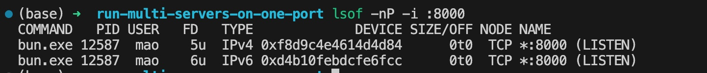
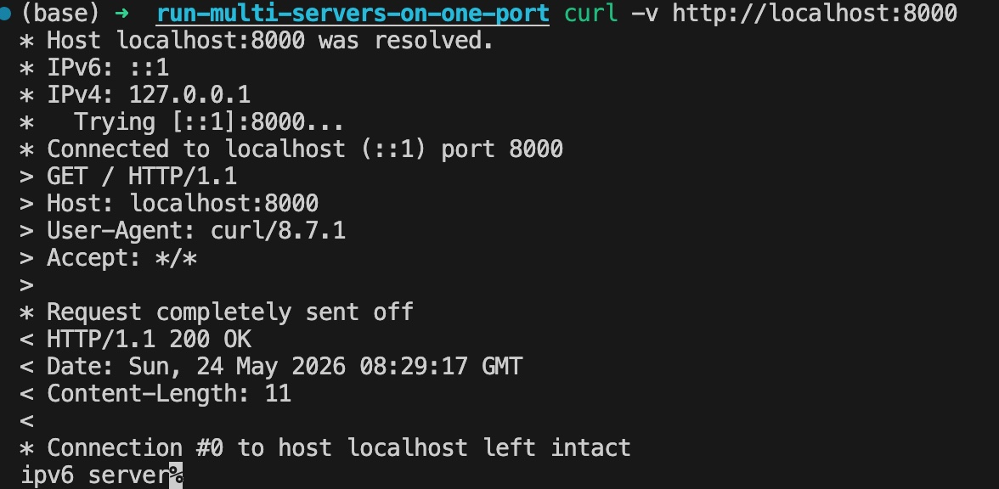
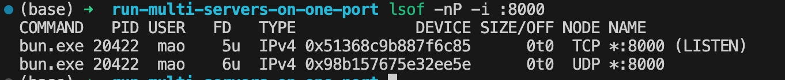
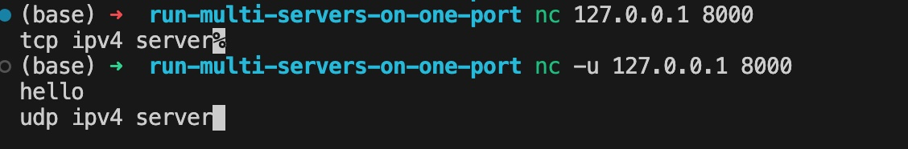
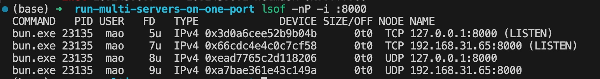
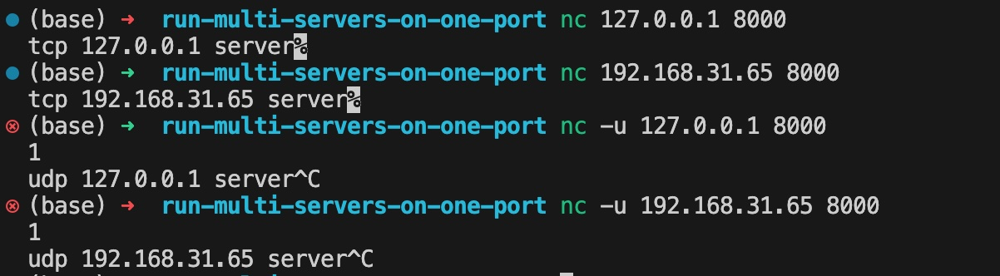
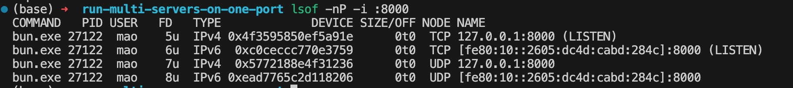
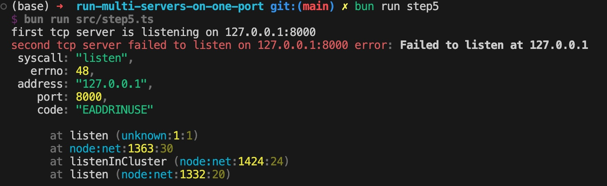
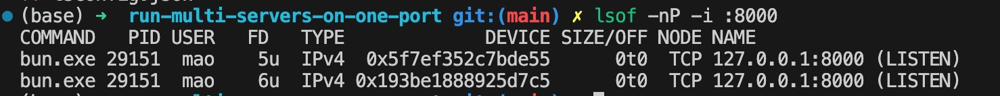
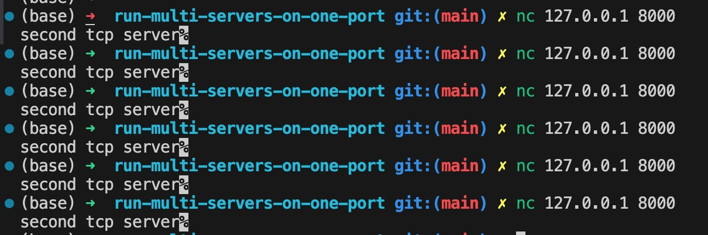

import ImageList from "@components/ImageList";

在以往的学习和工作中，我的认知是“在一个端口只能跑一个服务”，但是从来没有去深入探究过这个问题，只是把它当成一个常识。

不过在以往的前端开发中有遇到过这样一个问题：当我们在启动本地的前端项目时，发现访问对应端口时，页面始终不对，结果发现其实已经有另外一个 `ipv6` 的前端服务运行在对应的端口了，导致其实访问的是那个 `ipv6` 的服务，当时心存疑虑却没有好好的深入研究这个问题，那么这次我们就花点时间彻彻底底的给弄明白。

## 场景复现

要复现这个问题，其实非常简单，可以直接使用 `node` 启动在同一个端口启动两个 `http` 服务即可。

```typescript
import { createServer } from "node:http";

const PORT = 8000;

createServer((_, res) => res.end("ipv4 server"))
  .on("listening", () => console.log(`ipv4 server is listening on port ${PORT}`))
  .on("error", (error) => console.error(`ipv4 server failed to listen on port ${PORT}`, error))
  .listen(PORT, "0.0.0.0");

createServer((_, res) => res.end("ipv6 server"))
  .on("listening", () => console.log(`ipv6 server is listening on port ${PORT}`))
  .on("error", (error) => console.error(`ipv6 server failed to listen on port ${PORT}`, error))
  .listen({ port: PORT, host: "::", ipv6Only: true });
```

> `::` 是 `0:0:0:0:0:0:0:0` 的简写，等同于 `ipv4` 中的 `0.0.0.0`

当我们运行这个代码时，可以发现两个 `http server` 都成功的跑起来了，并且都是在 `8000` 端口上
我们可以通过 `lsof` 命令查看一下系统的端口占用情况，做一个检查



从图中我们确实可以看到 `8000` 端口同时跑了两个服务，一个是 `ipv4`，另一个是 `ipv6`，但是这个时候访问页面，你会发现固定返回的是 `ipv6` 的结果



从这个现象中，我们会有几个问题：

- 为什么一个端口可以跑多个服务，有没有什么限制？
- 可以在同一个端口跑两个 `ipv4` 或者 `ipv6` 的服务吗？如果不可以，为什么不可以？
- 为什么同一个端口跑了 `ipv4` 和 `ipv6` 的服务后，每次都是返回的 `ipv6` 呢，他们的顺序是谁规定的？
- 同一个端口最多可以跑多少个服务？

接下来，我们一点点弄懂这些问题。

## 先自己设计

我们一开始先不去看现在的实现，很容易陷入一大堆的概念中，比如 `OSI 七层模型`、`端口`、`协议` 等等。我们从最原始的逻辑出发，先自己尝试从最朴素的需求开始设计一套网络通信模型，设计到哪里卡住了，再去看现实系统是怎么解决的，这样才能知道这些概念是为了解决什么问题诞生的。

我们的目的是为了解决这样一个问题：一台电脑上会同时运行很多程序/服务，比如浏览器、编辑器、本地开发服务器、数据库等等。如果网络数据包到了这台电脑，操作系统要怎么知道这份数据应该交给哪个服务？

最容易想到的方案是：给每个服务分配一个编号。

```txt
服务 A -> 8000
服务 B -> 3000
服务 C -> 5432
```

这样一来，数据包里只要带上目标编号，操作系统就可以根据编号把数据交给对应的服务，这个编号也就是我们平时说的端口。

如果只看到这里，“一个端口只能跑一个服务”这个说法似乎是合理的。因为在现在的设计中，端口就是服务的唯一编号，两个服务如果都占用 `8000` 端口，系统当然不知道应该把数据交给谁，就会出现冲突。

现在我们面临设计上的第一个问题：端口号应该有多少个？

首先我们想到的肯定是是用一个无符号数字类型来表示端口，比如可以用 `uint8`、`uint16`、`uint32`、`uint64`，那么我们分别分析一下这几个类型所支持的端口数量以及空间占用。

| 类型     | 可表示的端口数量            | 空间占用 |
| -------- | --------------------------- | -------- |
| `uint8`  | 2^8 = 256                   | 1 字节   |
| `uint16` | 2^16 = 65536                | 2 字节   |
| `uint32` | 2^32 = 4294967296           | 4 字节   |
| `uint64` | 2^64 = 18446744073709551616 | 8 字节   |

考虑到在早期的网络通信设计中，由于早期计算机的内存、带宽、CPU 都比今天紧张得多，网络链路速度也低得多，所以需要尽可能的选择占用较少且数量足够的类型，那么 `uint32` 和 `uint64` 的性价比就非常低了，主要是是因为不太可能有这么多的服务同时在电脑上进行数据的收发。而且网络数据包需要在机器之间大量传输，每多一个字节都可能造成大量的不必要的空间浪费，而 `int8` 只能支持到 `256` 个端口数，感觉又不是特别够用，所以 `uint16` 是最好的选择了，只占用 `2字节`，并且能够支持 `65536` 个端口数，比较均衡。

所以会发现这个数字和现在的端口号范围 `0~65535` 是可以对得上的，那说明我们的理解和实际没有太大偏差。

## 端口不能脱离协议

现在我们需要引入 `协议` 的概念，因为不同的服务可能使用到不同的传输协议如 `TCP` 和 `UDP`。

假设我们现在有两个服务，它们都想使用 `8000` 端口：

```txt
TCP 服务 -> 8000
UDP 服务 -> 8000
```

按照我们现在的设计，因为 `8000` 已经被 TCP 服务占用了，后面启动 UDP 服务一定是无法再使用 `8000` 端口的。

回到我们最原始的需求，我们设计端口的目的，是为了让不同的服务可以在同一个系统上进行数据收发，并且能够准确的找到对应的服务。

而数据包在进入“端口分发”之前，其实已经先属于某一种协议了。一个 `TCP` 包和一个 `UDP` 包不是同一种东西，它们的协议头不同，处理方式也不同。既然协议都不同，那么他们就没有必要互斥了，系统仍然可以准确的把数据包发送给对应的服务。

当然，这里的协议只能是传输层的协议，因为端口本身就是传输层的一部分。

> 可能这里会有疑问，为什么端口得在传输层呢？我的理解是这样的，从物理层到网络层，目的是为了找到对应的设备，所以在这几层中，去关心 `端口` 显然不太合适，因为他们的目的不是为了区分服务，而是为了找到对应的设备，而传输层则开始涉及到数据传输的规则，也就是说它是关心数据发往什么地方的，以及从什么地方接受数据

所以，我们现在的模型变成了

```txt
传输层协议 + 端口 = 服务的唯一标识
```

基于这个结论，我们至少可以确定，同一个端口可以同时跑 `TCP` 和 `UDP` 两个服务，我们可以动手测试下，代码如下：

```typescript
import { createSocket } from "node:dgram";
import { createServer } from "node:net";

const PORT = 8000;

createServer((socket) => socket.end("tcp ipv4 server"))
  .on("listening", () => console.log(`tcp ipv4 server is listening on port ${PORT}`))
  .on("error", (error) => console.error(`tcp ipv4 server failed to listen on port ${PORT}`, error))
  .listen(PORT, "0.0.0.0");

const udpServer = createSocket("udp4")
  .on("listening", () => console.log(`udp ipv4 server is listening on port ${PORT}`))
  .on("message", (message, remote) => {
    udpServer.send("udp ipv4 server", remote.port, remote.address);
  })
  .on("error", (error) => console.error(`udp ipv4 server failed to listen on port ${PORT}`, error))
  .bind(PORT, "0.0.0.0");
```

运行后，继续使用 `lsof` 命令查看一下端口占用情况



可以发现，端口 `8000` 同时跑了 `TCP` 和 `UDP` 服务

> `UDP` 只有 `bind`，没有 `listen` 状态，所以没有 `LISTEN` 符号

也可以通过 `nc` 工具进行测试



## 端口不能脱离地址

目前已经可以解释 `TCP` 和 `UDP` 为什么可以使用同一个端口号，但它仍然默认“一台机器只有一个网络地址”。

实际并不是这样的，一台机器通常不只有一个地址。

比如本机回环地址 `127.0.0.1`， 局域网地址可能是 `192.168.x.x`，还有一个特殊地址 `0.0.0.0`。

这里我们遇到一个新问题：如果某个数据包目标端口相同，协议相同，但目标地址不同，系统是否应该把它交给不同的服务处理？

比如两个 TCP 服务都使用 `8000`，但是一个只接收本机访问，另一个只接收局域网访问。

按照现有的设计，它们仍然会冲突，因为都是 `TCP 8000`。但是从数据包本身看，它们其实可以被区分：

```txt
TCP / 127.0.0.1 / 8000
TCP / 192.168.x.x / 8000
```

客户端访问 `127.0.0.1:8000` 和访问 `192.168.x.x:8000`，目标 IP 本来就不一样，既然如此，操作系统完全可以把它纳入分发规则。

所以我们的设计变成了这样

```txt
本地地址 + 传输层协议 + 端口 = 服务
```

> `0.0.0.0` 地址有点特殊，他是一个通配地址，当监听 `0.0.0.0` 时，等同于本机所有 IPv4 地址，所以如果一个服务已经绑定了 `0.0.0.0:8000`，另一个服务再去绑定 `127.0.0.1:8000`，通常就会冲突。因为 `127.0.0.1` 已经包含在“所有 IPv4 地址”里面了

基于现在的结论，我们可以知道，对于 `TCP` 和 `UDP` 来说都可以分别绑定不同的本地地址，我们可以测试一下

```typescript
import { createSocket } from "node:dgram";
import { createServer } from "node:net";

const PORT = 8000;

createServer((socket) => socket.end("tcp 127.0.0.1 server"))
  .on("listening", () => console.log(`tcp 127.0.0.1 server is listening on port ${PORT}`))
  .on("error", (error) => console.error(`tcp 127.0.0.1 server failed to listen on port ${PORT}`, error))
  .listen(PORT, "127.0.0.1");

createServer((socket) => socket.end("tcp 192.168.31.65 server"))
  .on("listening", () => console.log(`tcp 192.168.31.65 server is listening on port ${PORT}`))
  .on("error", (error) => console.error(`tcp 192.168.31.65 server failed to listen on port ${PORT}`, error))
  .listen(PORT, "192.168.31.65");

const udpLocalhostServer = createSocket("udp4")
  .on("listening", () => console.log(`udp 127.0.0.1 server is listening on port ${PORT}`))
  .on("message", (_, remote) => {
    udpLocalhostServer.send("udp 127.0.0.1 server", remote.port, remote.address);
  })
  .on("error", (error) => console.error(`udp 127.0.0.1 server failed to listen on port ${PORT}`, error))
  .bind(PORT, "127.0.0.1");

const udpLanServer = createSocket("udp4")
  .on("listening", () => console.log(`udp 192.168.31.65 server is listening on port ${PORT}`))
  .on("message", (_, remote) => {
    udpLanServer.send("udp 192.168.31.65 server", remote.port, remote.address);
  })
  .on("error", (error) => console.error(`udp 192.168.31.65 server failed to listen on port ${PORT}`, error))
  .bind(PORT, "192.168.31.65");
```

运行后，同样使用 `lsof` 命令查看一下端口占用情况



`nc` 工具测试结果



可以发现，确实每个都是独立的服务。至此，我们的想法和设计是和实际相符的

## IPv4 和 IPv6

在我们现有的设计中，都只考虑到了 `ipv4` 地址，但是现实中，还存在 `ipv6` 地址，不过他们并没有本质上的区别，只是地址的表示形式不同而已，都属于 `ip 地址`

所以在现在的设计中，应该也是可以直接兼容 `ipv6` 的，也就是说可以分别在 `TCP`、`UDP` 中分别跑 `ipv4` 和 `ipv6` 的服务

我们可以通过如下代码进行测试

```typescript
import { createSocket } from "node:dgram";
import { createServer } from "node:net";

const PORT = 8000;
const IPV4_HOST = "127.0.0.1";
const IPV6_HOST = "fe80::2605:dc4d:cabd:284c%utun0";

createServer((socket) => socket.end("tcp ipv4 server"))
  .on("listening", () => console.log(`tcp ipv4 server is listening on ${IPV4_HOST}:${PORT}`))
  .on("error", (error) => console.error(`tcp ipv4 server failed to listen on ${IPV4_HOST}:${PORT}`, error))
  .listen(PORT, IPV4_HOST);

createServer((socket) => socket.end("tcp ipv6 server"))
  .on("listening", () => console.log(`tcp ipv6 server is listening on [${IPV6_HOST}]:${PORT}`))
  .on("error", (error) => console.error(`tcp ipv6 server failed to listen on [${IPV6_HOST}]:${PORT}`, error))
  .listen(PORT, IPV6_HOST);

const udpIpv4Server = createSocket("udp4")
  .on("listening", () => console.log(`udp ipv4 server is listening on ${IPV4_HOST}:${PORT}`))
  .on("message", (_, remote) => {
    udpIpv4Server.send("udp ipv4 server", remote.port, remote.address);
  })
  .on("error", (error) => console.error(`udp ipv4 server failed to listen on ${IPV4_HOST}:${PORT}`, error))
  .bind(PORT, IPV4_HOST);

const udpIpv6Server = createSocket("udp6")
  .on("listening", () => console.log(`udp ipv6 server is listening on [${IPV6_HOST}]:${PORT}`))
  .on("message", (_, remote) => {
    udpIpv6Server.send("udp ipv6 server", remote.port, remote.address);
  })
  .on("error", (error) => console.error(`udp ipv6 server failed to listen on [${IPV6_HOST}]:${PORT}`, error))
  .bind(PORT, IPV6_HOST);
```

结果如下图，和预期也是相符的



## 能否多个服务绑定同一个地址和端口

在我们现在的设计中，`本地地址 + 传输层协议 + 端口` 等于是一个唯一标识，是完全不能够重复的，我们可以用代码测试一下，如果完全一致，会发生什么问题

```typescript
import { createServer } from "node:net";

const PORT = 8000;
const HOST = "127.0.0.1";

createServer((socket) => socket.end("first tcp server"))
  .on("listening", () => console.log(`first tcp server is listening on ${HOST}:${PORT}`))
  .on("error", (error) => console.error(`first tcp server failed to listen on ${HOST}:${PORT}`, error))
  .listen(PORT, HOST);

createServer((socket) => socket.end("second tcp server"))
  .on("listening", () => console.log(`second tcp server is listening on ${HOST}:${PORT}`))
  .on("error", (error) => console.error(`second tcp server failed to listen on ${HOST}:${PORT}`, error))
  .listen(PORT, HOST);
```

运行时会发现如下的报错



很明显，从系统的角度来说，如果两个服务的地址、协议、端口完全一致，那么它是没办法区分数据包要交给哪个服务处理的。

不过当你问 AI 时，会发现可以通过 `SO_REUSEPORT` 来强制让多个服务跑在同一个 `本地地址 + 传输层协议 + 端口` 上，代码如下

```typescript
import { createServer } from "node:net";

const PORT = 8000;
const HOST = "127.0.0.1";

createServer((socket) => socket.end("first tcp server"))
  .on("listening", () => console.log(`first tcp server is listening on ${HOST}:${PORT}`))
  .on("error", (error) => console.error(`first tcp server failed to listen on ${HOST}:${PORT}`, error))
  .listen({ port: PORT, host: HOST, reusePort: true });

createServer((socket) => socket.end("second tcp server"))
  .on("listening", () => console.log(`second tcp server is listening on ${HOST}:${PORT}`))
  .on("error", (error) => console.error(`second tcp server failed to listen on ${HOST}:${PORT}`, error))
  .listen({ port: PORT, host: HOST, reusePort: true });
```

运行后会发现没有报错了，并且 `lsof` 结果如下



而且当你访问时会发现始终都是连接到第二个 tcp 服务的



这个问题就不在这里探究了，或许你可以自己尝试去弄清楚：

1. 同一个 `本地地址 + 传输层协议 + 端口` 最多能跑多少个服务呢？
2. 是否永远是后创建的服务覆盖之前的服务呢？系统会有什么策略吗？

所以结论为：正常情况下，是不可以把多个服务运行在 `本地地址 + 传输层协议 + 端口` 上的，除非使用 `SO_REUSEPORT`

## 为什么访问 localhost 总是到了 IPv6 服务

首先，`ipv4` 和 `ivp6` 是可以运行独立的服务的，所以问题是出在 `localhost` 解析到 `本地地址` 的链路上。

从之前的 `curl` 结果中可以明显的看到 `localhost` 同时解析出来了 `ipv6` 和 `ipv4` 两个地址，但是优先尝试访问的是 `ipv6` 地址。

通过查资料发现 [rfc 6724](https://www.rfc-editor.org/rfc/rfc6724.html#section-10.3) 中有相关的定义：

默认策略表会让 IPv6 地址比 IPv4 地址有更高 precedence；当两者同样合适时，IPv6 会排在前面

所以大体上是可以认为，大部分的软件/工具在域名时，优先会解析为 `ipv6` 地址

## 总结

现在，我们可以回答最开始提出的那几个问题了。

### 为什么一个端口可以跑多个服务，有没有什么限制？

因为系统是以 `本地地址 + 传输层协议 + 端口` 为唯一标识的，所以只要 `本地地址 + 传输层协议` 不同，就可以跑在同一个端口上

### 可以在同一个端口跑两个 `ipv4` 或者 `ipv6` 的服务吗？如果不可以，为什么不可以？

在同一个端口中，如果都是跑 `TCP` 协议，那么可以同时跑多个 `ipv4` 地址。也可以跑同一个地址，但是分别是 `TCP` 和 `UDP` 协议

### 为什么同一个端口跑了 `ipv4` 和 `ipv6` 的服务后，每次都是返回的 `ipv6` 呢，他们的顺序是谁规定的？

根据 [rfc 6724](https://www.rfc-editor.org/rfc/rfc6724.html#section-10.3) ，只能说现代的软件/工具往往会优先尝试 `ipv6`，其次再是 `ipv4`

### 同一个端口最多可以跑多少个服务？

在不考虑 `SO_REUSEPORT` 的情况下，同一个端口最多可以跑的服务数量取决于 `ipv4` 和 `ipv6` 的地址数，再乘以 2 (两种协议)

## 代码

上述使用到的测试代码都放在了 [repo](https://github.com/buding0904/run-multi-servers-on-one-port) 中，有兴趣的可以 clone 下来跑一跑
